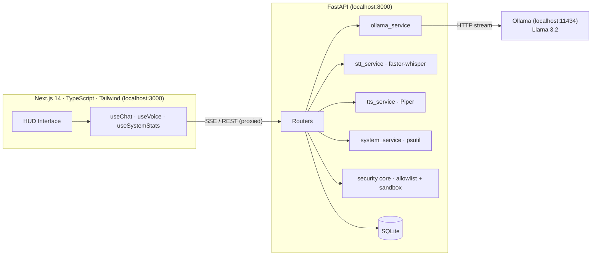

<div align="center">

# ⬢ ATLAS COMMAND

**A fully local, military-style AI command system.**
Atlas Corporation aesthetics · zero cloud · zero API keys · zero data egress.


*"Awaiting your directive, Administrator."*

<!-- Add after first run:  -->

</div>

---

ATLAS (Autonomous Tactical Logistics & Analysis System) is a privacy-first AI assistant that runs **entirely on localhost**. It streams responses from a local LLM, hears you through offline Whisper, answers in a deep synthesized voice via Piper, remembers conversations in SQLite, and monitors your machine in real time — all wrapped in a cinematic HUD inspired by *Call of Duty: Advanced Warfare*'s Atlas interface.

## Features

- **Streaming chat** with a local LLM (Ollama · Llama 3.2 3B by default — fast even on 8 GB machines; swap in any larger model via `.env`) over Server-Sent Events
- **Voice in**: offline speech-to-text (faster-whisper) with push-to-talk *and* always-listening mode with silence detection
- **Voice out**: offline TTS (Piper, `en_US-ryan-high` — deep and authoritative)
- **Persistent memory**: conversations, history, and preferences in SQLite
- **Live telemetry**: CPU, RAM, disk, network, and uptime dashboard (psutil)
- **Sandboxed file search** limited to directories you explicitly approve
- **Safe command execution**: fixed allowlist, no shell, no user-supplied arguments, hard timeouts
- **Cinematic UI**: boot sequence, HUD panels with corner brackets, scanlines, vignette, reactive AI core, message animations, gold/cyan glow, fully responsive
- **Synthesized HUD sound effects** (Web Audio — zero asset files): transmit blips and reply confirmation tones
- **Keyboard shortcuts**: `/` focus input · `Enter` send · `Ctrl+Space` toggle comms channel
- **Customizable persona** and callsign (Administrator / Commander) stored as preferences

## Architecture



**Request flow (chat):** browser POSTs to `/api/chat` → backend persists the user message, assembles persona + last 20 messages, streams tokens from Ollama back as SSE frames, then persists the full reply. **Voice flow:** MediaRecorder captures webm → `/api/voice/transcribe` (Whisper) → transcript auto-submitted to chat → reply optionally rendered to WAV by `/api/voice/speak` (Piper) and played in-browser.

## Project structure

```
atlas-command/
├── backend/
│   ├── app/
│   │   ├── main.py              # FastAPI entry point (localhost-only)
│   │   ├── config.py            # .env-driven settings
│   │   ├── database.py          # SQLAlchemy models + SQLite session
│   │   ├── schemas.py           # Pydantic request/response models
│   │   ├── core/
│   │   │   ├── personality.py   # ATLAS persona system prompt
│   │   │   └── security.py      # command allowlist + path sandbox
│   │   ├── routers/             # chat · voice · system · files · commands · settings
│   │   └── services/            # ollama · stt · tts · system · file · command
│   ├── requirements.txt
│   └── .env.example
├── frontend/
│   ├── app/                     # layout, page, global HUD styles
│   ├── components/              # BootSequence · Sidebar · AtlasCore · ChatPanel · ChatInput · SystemMonitor
│   ├── hooks/                   # useChat · useVoice · useSystemStats
│   └── lib/                     # typed API client + shared types
├── scripts/                     # setup.sh · run.sh
└── docs/                        # ARCHITECTURE.md · SECURITY.md
```

## Getting started

**Prerequisites:** Python 3.11+, Node 18+, [Ollama](https://ollama.com/download), ~6 GB disk for models.

```bash
git clone https://github.com/amirali-nam/Atlas-Ai.git && cd Atlas-Ai
./scripts/setup.sh     # venv + pip, npm install, ollama pull llama3.2:3b, Piper voice download
./scripts/run.sh       # backend :8000 + frontend :3000
```

Open **http://localhost:3000**. API docs live at http://localhost:8000/docs.

<details>
<summary><b>Manual setup / Windows</b></summary>

```bash
# Backend
cd backend
python -m venv .venv && .venv\Scripts\activate      # source .venv/bin/activate on mac/linux
pip install -r requirements.txt
copy .env.example .env
uvicorn app.main:app --port 8000

# Frontend (second terminal)
cd frontend
npm install && npm run dev

# Models (third terminal)
ollama pull llama3.2:3b
# Piper voice: download en_US-ryan-high.onnx (+.json) from
# https://huggingface.co/rhasspy/piper-voices into backend/models/
```
</details>

### Configuration (`backend/.env`)

| Variable | Default | Purpose |
|---|---|---|
| `OLLAMA_MODEL` | `llama3.2:3b` | Any Ollama model — use `llama3.1` (8B) with 16 GB+ RAM |
| `WHISPER_MODEL` | `tiny` | tiny/base/small/medium/large-v3 |
| `PIPER_VOICE` | `models/en_US-ryan-high.onnx` | Any Piper voice |
| `ALLOWED_SEARCH_ROOTS` | *(empty = disabled)* | Comma-separated dirs the assistant may search |

## Security & privacy

- **Zero egress**: every service binds to localhost; no telemetry, no analytics, no external API calls. The only network use is the one-time model download during setup.
- **Command execution** is limited to a hard-coded allowlist of fixed argv lists — no shell interpretation, no user-supplied arguments, 10 s timeout, capped output.
- **File search** is disabled by default and, when enabled, is confined to explicitly approved roots with symlink-escape protection.
- **Permissions used**: microphone (browser prompt, voice input only), read access to configured search roots, process/disk stats via psutil.

See [docs/SECURITY.md](docs/SECURITY.md) for the full threat model.

## Skills demonstrated

Full-stack architecture (typed API contract between FastAPI and a Next.js App Router client) · async Python and SSE streaming · local LLM integration and prompt/persona engineering · offline speech pipelines (Whisper STT, Piper TTS, browser MediaRecorder + Web Audio silence detection) · relational modeling with SQLAlchemy 2.0 · security-conscious design (sandboxing, allowlisting, input validation) · custom design-system work in Tailwind (HUD components, animation, responsive layout) · developer experience (one-command setup, env-driven config, OpenAPI docs).

## Roadmap

- [ ] Tool-calling: let the model invoke file search / telemetry autonomously
- [ ] Wake-word detection ("Atlas") via openWakeWord
- [ ] RAG over local documents with a local embedding model
- [ ] Multi-model switching from the UI
- [ ] Dockerized one-command deployment
- [ ] Optional web-browsing tool when internet is available

## License

MIT — see [LICENSE](LICENSE).
